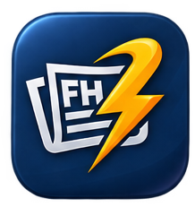

  

  # Flash Hideline

  **A modern, lightweight Android news app delivering real-time global headlines.**

  | Category Screen | News Source & Search | Article List | Article Detail |
  | :---: | :---: | :---: | :---: |
  |  |  |  |  |
  |  |  |  |  |

---

## 🎨 Design System & Branding

* **Character:** Fast, modern, and direct to the point.
* **Palette:**
  * **Primary (Deep Slate):** `#1E293B`
  * **Accent (Electric Amber/Yellow):** `#F59E0B` *(represents "flash / speed")*
  * **Background:** `#FAFAFA`
  * **Text:** `#18181B`

---

## 📌 About & Key Features

**Flash Hideline** is powered by the **[NewsAPI.org](https://newsapi.org)** API, built to provide a clean and fast news-browsing experience.

* **Category & Source Filtering:** Browse news by category (Business, Tech, Sports, etc.) and filter by trusted publishers.
* **Smart Search & Pagination:** Debounced search with inline loading indicators and seamless infinite scrolling.
* **Article Reader:** Detailed article previews with direct links to full news stories.

---

## 🛠️ Tech Stack & Architecture

* **UI Framework:** **Jetpack Compose** (Declarative UI, Material 3, Custom Composables)
* **Architecture:** MVVM + Clean Architecture, Single Activity Pattern
* **State & Async:** StateFlow / SharedFlow, Kotlin Coroutines, Channel (UiEffect)
* **Dependency Injection:** Hilt
* **Networking:** Retrofit2, OkHttp3 (with Logging Interceptor)
* **Navigation & Image:** Navigation Compose, Coil
* **Compatibility:** Min SDK 24 (Android 7.0+)

---

## 💡 Why This Architecture?

Transitioning to **Jetpack Compose + MVVM** for this project was a deliberate challenge. Having spent 5 years specializing in XML and MVC, I built this application within a tight deadline to demonstrate my ability to quickly adapt to modern Android standards and existing codebase requirements.

While adopting declarative UI was a new paradigm for me, this project serves as proof of my technical adaptability—showing that strong core mobile engineering fundamentals allow for fast technology adoption and continuous growth.
